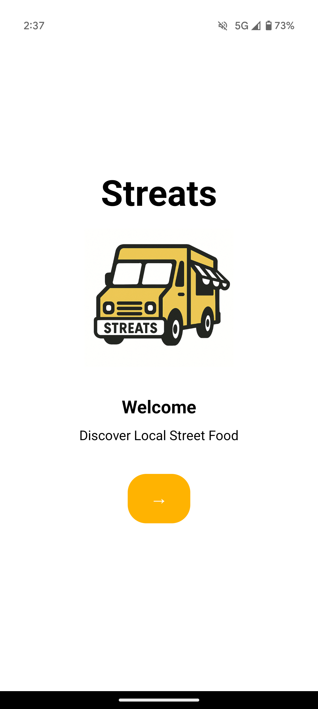
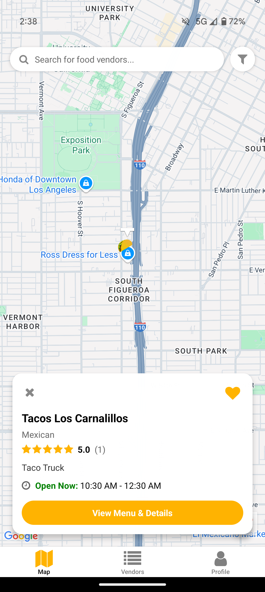
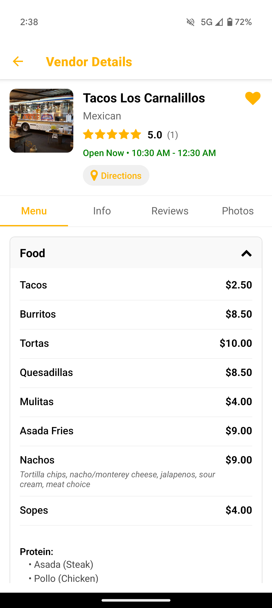
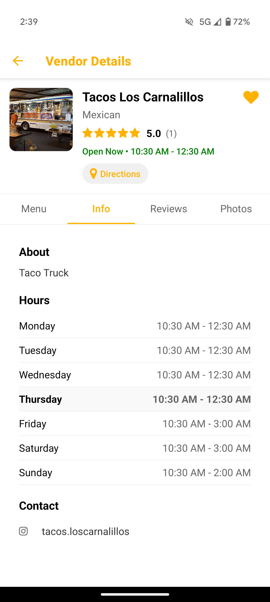
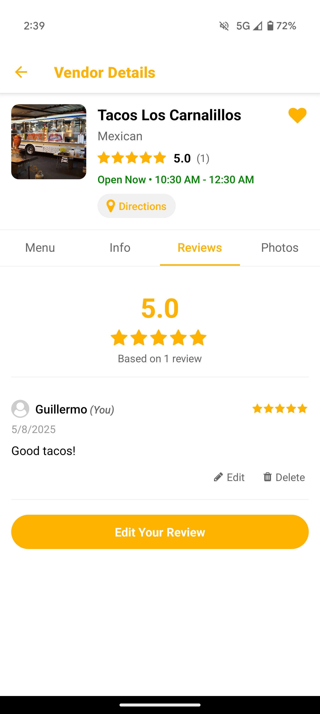
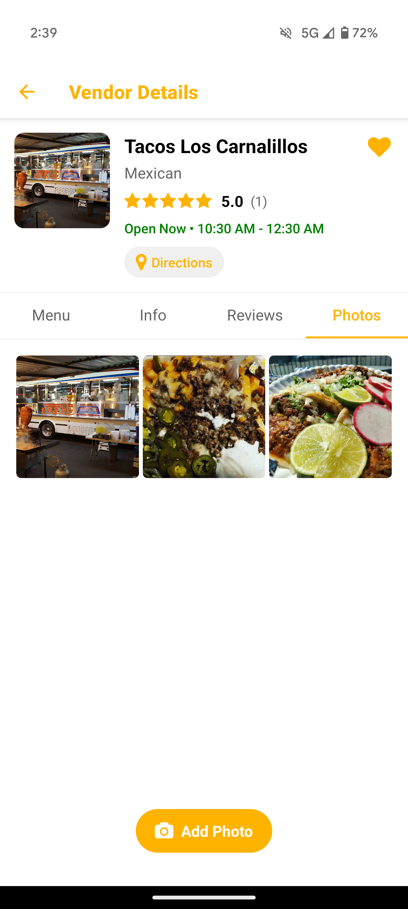
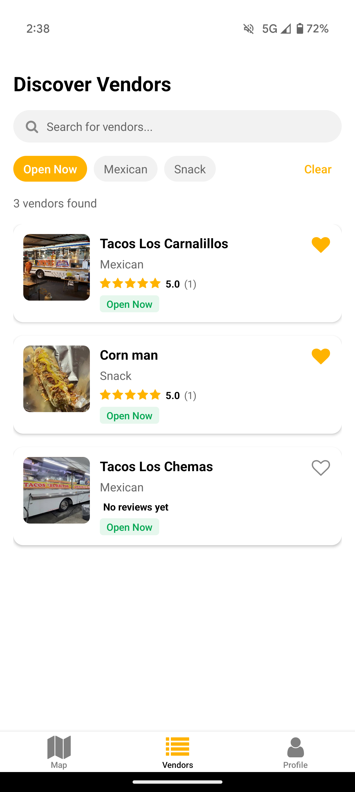

# Streats 
*LA Street Food Finder App*  

## Overview 
Streats is a mobile app designed to make finding LA's best street food (food trucks, stands, carts, ice cream trucks and more) easy. The goal is to provide an easy way for users to explore LA's vast food culture and support local businesses, and for local street vendors to expand their reach and customer accessibility.

## Features 
- 📍 **Real-time vendor locations**  
- 🔍 **Search & filter by cuisine** 
- 🍦 **Vendor specific markers**
- 📃 **View up-to-date menus and hours**
- ⭐ **User reviews & ratings**
- ❤️ **User favorited vendors**
- 💸 **Vendor mode**

## Tech Stack  
- **Frontend:** React Native w/ Expo
- **Backend:** Firebase  
- **Database:** Firestore

---
 

  
  
  
  
  
  
  
  

